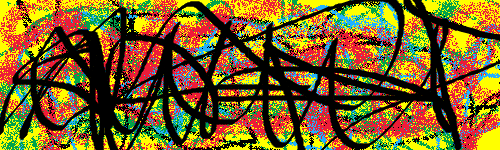

# Ebook DRM writeup

First of all we look through the site and see that it has no visible vulnerabilities, so we need to write a captcha solver.

After manual solution of some captchas we notice that every captcha has the same background and yellow letters are xor-ed with the background image. So we can manually reassemble background image from several captchas.

After that we write [solution](rerecaptcha.py) script. In while loop we [query](https://github.com/SRCteam-CTF/utcctf-2022/blob/9875de0ad1fb2a57f93068fbd45dbd0396a43cfa/rerecaptcha/rerecaptcha.py#L76) next captcha, [xor it](https://github.com/SRCteam-CTF/utcctf-2022/blob/9875de0ad1fb2a57f93068fbd45dbd0396a43cfa/rerecaptcha/rerecaptcha.py#L95) with `index.png` using ImageOps, [split](https://github.com/SRCteam-CTF/utcctf-2022/blob/9875de0ad1fb2a57f93068fbd45dbd0396a43cfa/rerecaptcha/rerecaptcha.py#L173) letters and [enumerate](https://github.com/SRCteam-CTF/utcctf-2022/blob/9875de0ad1fb2a57f93068fbd45dbd0396a43cfa/rerecaptcha/rerecaptcha.py#L48) all collected letter images(script also collects unknown letters for you to label them) to find the nearest one. Repeat 1000 times. Thanks to authors, we can revert to previous stage, if script has failed to solve some captcha.

Flag: `utflag{skibidi_bop_mm_dada_uLG7Jrd5hP}`